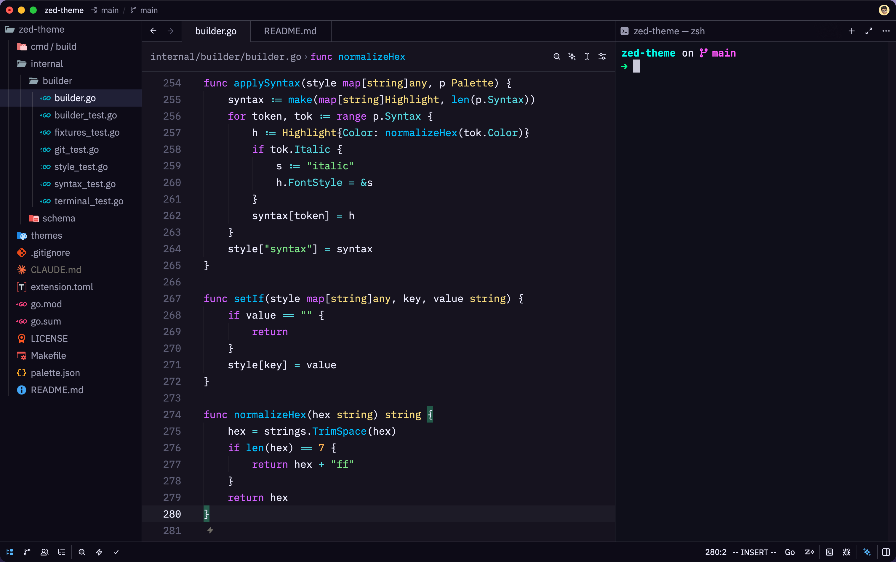

# Veda Pro

A vivid, One Dark Pro-inspired dark theme for [Zed](https://zed.dev), set on a
deep violet-indigo background. Built for developers who want punchy syntax
highlighting against a calm, low-glare surface — with a coordinated 16-color
ANSI palette so the integrated terminal matches the editor.



**Appearance:** Dark · **Schema:** Zed themes v0.2.0

## Highlights

- **Deep violet-indigo background** `#15131f`, with two coordinated shades for
  depth: `#0d0b17` for sidebars, panels, and popovers (editor −8 per channel)
  and `#1d1b27` for the active line and hover lifts (editor +8 per channel).
- **Vivid syntax** — recognizable One Dark Pro hue assignments with the
  saturation pushed for a dark surface: purple keywords, electric-blue
  functions, green strings, yellow types, cyan properties and operators,
  orange constants.
- **Italics** on comments, `comment.doc`, `variable.special`, `predictive`,
  and `link_text` — the One Dark Pro convention.
- **Coordinated terminal** — a vivid neon 16-color ANSI palette keeps the
  in-editor terminal visually consistent with the theme.
- **Accent** — vivid blue `#57B9FF` for focused borders, links, selectors,
  and active tab indicators.

## Install

### From the Zed extension registry

Open the command palette → `zed: extensions`, search **Veda Pro**, and
click Install. Then switch to it via `zed: open theme selector` →
**Veda Pro**.

### Local / development install

From a clone of this repo:

```bash
zed --install-dev-extension .
```

Then switch to it via `zed: open theme selector` → **Veda Pro**.

## Palette

### UI surfaces

| Surface | Role | Hex |
|---|---|---|
| Editor background | base surface | `#15131f` |
| Panel / sidebar / popover | editor −8 per channel | `#0d0b17` |
| Active line / hover lift | editor +8 per channel | `#1d1b27` |
| Foreground | default text | `#ededfe` |
| Selection | text selection | `#202036` |
| Cursor | muted off-white | `#c9c9d8` |
| Accent | focus, links, selectors | `#57B9FF` |
| Terminal background | terminal surface | `#0f0f1a` |
| Terminal ANSI 0–15 | vivid neon ANSI palette | — |

### Syntax highlighting

| Tokens | Color | Hex |
|---|---|---|
| Keywords, `this`/`self`, regex, special strings | purple | `#D362FF` |
| Functions | electric blue | `#00BFFF` |
| Strings, added / diff-plus | green | `#7EE787` |
| Types, enums, namespaces, constructors | yellow | `#F8DC7E` |
| Constants, numbers, booleans, attributes | orange | `#FFB454` |
| Properties, operators, escapes | cyan | `#56DCE4` |
| Tags, emphasis, removed / diff-minus | red | `#FF5C6C` |
| Links, titles, list markers, selectors | accent blue | `#57B9FF` |
| Comments (italic) | gray | `#5C6370` |
| Variables, punctuation | foreground | `#ededfe` |

References:
- One Dark (Zed): <https://github.com/zed-industries/zed/blob/main/assets/themes/one/one.json>
- Zed theme schema v0.2.0: <https://zed.dev/schema/themes/v0.2.0.json>

## Development

Veda Pro is **generated**. Every color in `themes/veda-pro.json` originates in
`palette.json` — never edit the generated theme file by hand. A small Go
program reads `palette.json`, transforms it into the Zed schema shape, and
validates the output against the v0.2.0 schema before writing it.

```bash
make test       # run the test suite (builder + schema + integration)
make build      # regenerate themes/veda-pro.json from palette.json
make            # both
```

To change a color: edit `palette.json`, then run `make`. The build fails if the
result doesn't validate against the Zed schema, so a green build is a passing
validation.

## Project structure

```
veda-pro-zed/
├── extension.toml          # Zed extension manifest
├── palette.json            # semantic source of truth (edit this)
├── themes/veda-pro.json    # generated artifact (do not edit)
├── preview.png             # screenshot used in this README
├── cmd/build/              # Go program: palette → theme + validate
├── internal/builder/       # palette → ThemeFamily transformer
├── internal/schema/        # vendored v0.2.0 schema + validator
├── README.md
├── LICENSE
└── Makefile
```

## License

[MIT](LICENSE) © 2026 Manikandan
